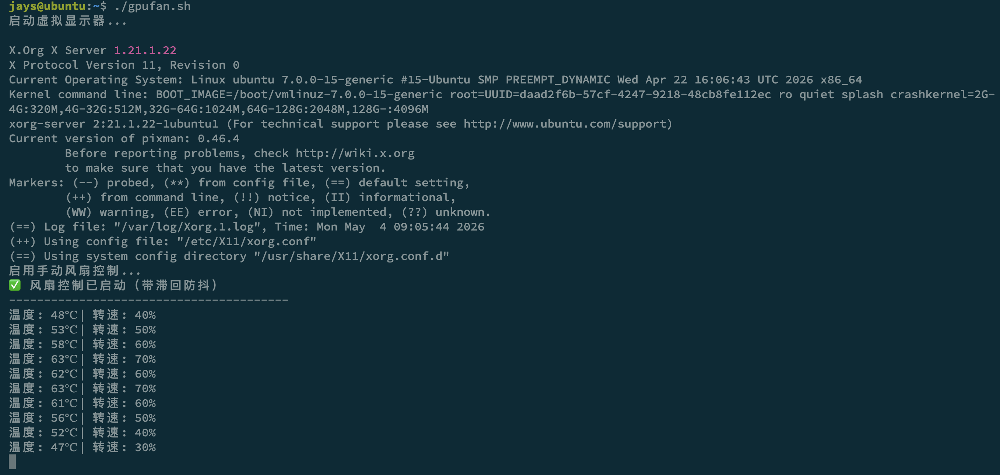

test on ubuntu 26.04 with GTX 1060
NVIDIA-SMI 580.142  Driver Version: 580.142  CUDA Version: 13.1

# Introduction
ubuntu-gpufan-control_withoutscreen

# Usage
sudo chmod +x gpufan.sh
./gpufan.sh


# Persistence
sudo mv gpufan.sh /usr/local/bin/
sudo nano /etc/systemd/system/gpufan.service
```
[Unit]
Description=NVIDIA Fan Curve Control
After=network.target

[Service]
Type=simple
ExecStart=/bin/bash /usr/local/bin/gpufan.sh
Restart=always
RestartSec=5
User=root

[Install]
WantedBy=multi-user.target
```
sudo systemctl daemon-reload
sudo systemctl enable gpufan.service
sudo systemctl start gpufan